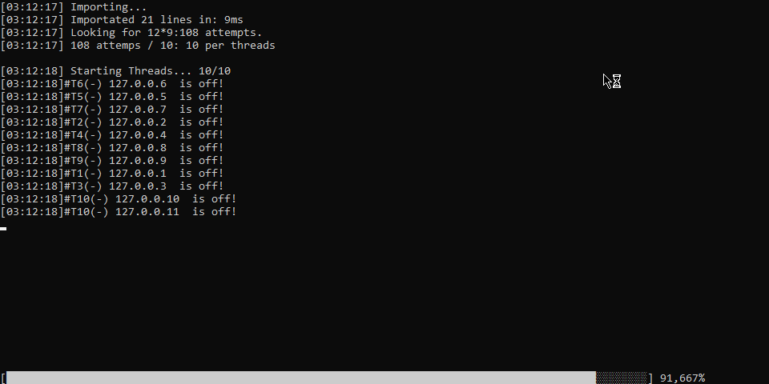

# BetterSSHChecker
Simple multithreaded automatisation of the SSH.Net library.

Usage:
pwner.exe --source:result.txt --userpass:userpass.txt -t 5000 -T 10 -mT 8 --dp

*-t: timeout

*-T: threads

*-mT: max timed out

*--dp: draw the progressbar

~100 attemps/m
~0-3 attemps/s

